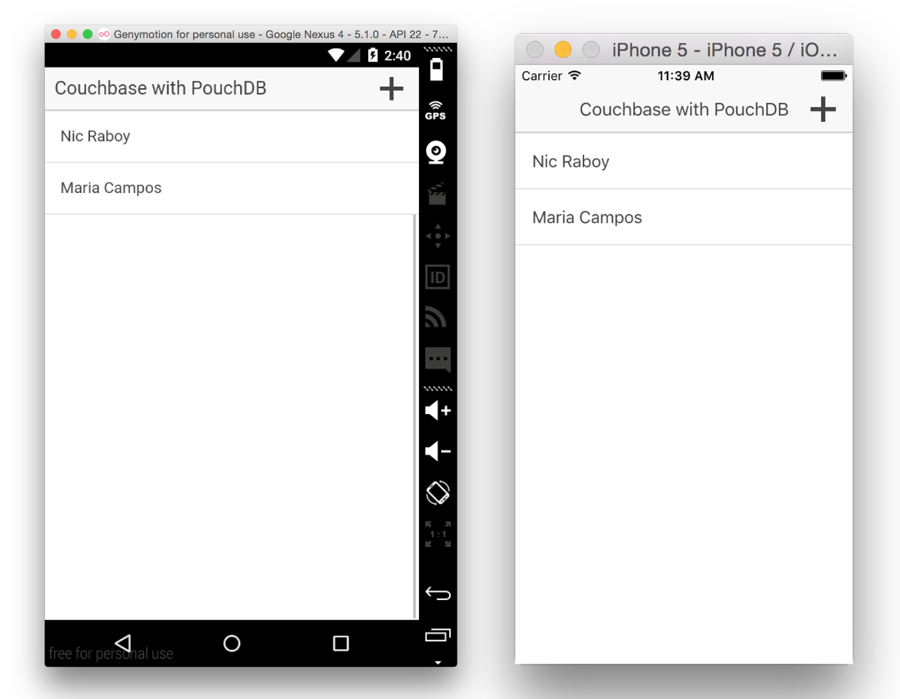

# Couchbase Mobile PouchDB Workshop

In this workshop you'll learn how to create a mobile Android and iOS application that synchronizes between devices and platforms using PouchDB, Ionic Framework, Couchbase Sync Gateway and Couchbase Server.

This document will help you through the process for building such an application.

## What's Included

You may be viewing this tutorial from your web browser via GitHub or on your local file system after cloning the repository.  Whatever the scenario, you should see the following files and directories:

```
initial/
finished/
images/
README.md
Couchbase Mobile PouchDB Workshop.pptx
```

The `initial` directory contains the starting point for our workshop.  It is an incomplete version of the final result that we'll fill in throughout this document.  The `finished` directory contains the final result that we are trying to accomplish.  It can also be used to help get you through the workshop if you get stuck.

The `images` directory contains screenshots of various steps used in this `README.md` tutorial document.  Finally if you'd like to see some educational slides you can view the `Couchbase Mobile PouchDB Workshop.pptx` PowerPoint slide deck.

## The Requirements

There are a few requirements necessary before being able complete this workshop:

1. The [Android SDK](http://developer.android.com/sdk/index.html), Xcode, or both must be installed
2. [Node.js](https://nodejs.org) 5 must be installed
3. [Ionic](http://ionicframework.com/getting-started/) Install require frameworks
4. [Couchbase Sync Gateway](http://www.couchbase.com/nosql-databases/downloads)

Although not required, the Android third party simulator, [Genymotion](https://www.genymotion.com), would be useful.

## Agenda

1. Getting Started
    1. Restoring Platforms and Plugins
    2. Running Sync Gateway
    3. Running the Finished Project
2. STEP 1: Creating a New PouchDB Local Database
3. STEP 2: Creating a Function for Saving Documents to the Database
4. STEP 3: Listening for Changes in the PouchDB Service
5. STEP 4: Retrieving a Particular Document in the PouchDB Service
6. STEP 5: Syncing with Couchbase Sync Gateway via the PouchDB Service
7. STEP 6: Listening for Broadcasts in the AngularJS Controller
8. STEP 7: Including Couchbase Sync Gateway
9. STEP 8: Allowing CORS in Sync Gateway

## Getting Started

In the getting started, you will get the project set up locally, verify it by running the `finished` project, then switch to the `initial` project to follow the steps which will have you learn the Ionic Framework and PouchDB basics.

We are starting with the `finished` project because the `initial` project has holes in it that will prevent it from running before completing the workshop.  By running `finished` we can prove that our environment is correct and ready to use.



### Restoring Platforms and Plugins

Both the `initial` and `finished` projects have dependencies that were not pushed to GitHub.  After downloading or cloning either of the projects, navigate into them via a Command Prompt or Terminal and execute the following:

```
ionic state restore
```

This will re-install the platforms and all plugins required by Ionic Framework to run.

### Running Sync Gateway

With Couchbase Sync Gateway downloaded and extracted.  Execute the following:

```
/path/to/sync/gateway/bin/sync-gateway /path/to/finished/sync-gateway-config.json
```

### Running the Finished Project

To run the `finished` project, execute the following from the Command Prompt or Terminal:

```
ionic run android
ionic run ios
```

If you're using a Windows or Linux computer, you cannot build for iOS.  It is a luxury of Mac only.

## STEP 1: Creating a New PouchDB Local Database

From within the `initial/` folder and inside the **www/js/app.js** file there is a blue-print to an AngularJS service called `$pouchDB`.  In it we'll be creating many functions all with the purpose of interfacing with the PouchDB JavaScript library.  Because PouchDB is vanilla JavaScript and Ionic Framework uses AngularJS, we need to wrap the PouchDB functions in this service to make it more AngularJS friendly.

Per the PouchDB documentation, a local database can be created by calling the following:

```JavaScript
var database = new PouchDB("database_name_here");
```

Create a function local to the `$pouchDB` service that will create this database.  Use the `database` variable that is available throughout the service itself.

## STEP 2: Creating a Function for Saving Documents to the Database

With the database in place it would probably be a good idea to save data to it.  With PouchDB there are two ways to save NoSQL data.  We could choose to use a `POST` request like follows:

```JavaScript
database.post({}).then(function(response) {
    // Save successful
}).catch(function(error) {
    // Error saving
});
```

Or we could choose to use a `PUT` request like this:

```JavaScript
database.put({}).then(function(response) {
    // Save successful
}).catch(function(error) {
    // Error saving
});
```

These functions are near identical, with one very important difference.  When doing a `POST`, a unique id for the document is automatically chosen making it a better solution for creating or inserting data.  A `PUT` request requires an id value making it an ideal solution for updating data.

In both scenarios, the `{}` represents the JavaScript object to be saved.

Since both these PouchDB functions are asynchronous, we need to create a function that will return a promise.  Within the `$pouchDB` service, create a single save function that will either insert or update depending on if an `_id` property is provided.  This function should return a promise.

## STEP 3: Listening for Changes in the PouchDB Service

Now that data is being saved, the UI should probably know about what is happening.  PouchDB has a JavaScript change listener that can be used to identify if local or remote changes have happened.  It is typically used like the following:

```JavaScript
var changeListener = database.changes({
    live: true,
    include_docs: true
}).on("change", function(change) {
    // Changes
});
```

The UI cannot be updated via the AngularJS service.  This can easily be corrected by having the PouchDB changes broadcast on the AngularJS `$rootScope` which is a global application scope.

Typically a broadcast might look like the following:

```JavaScript
$rootScope.$broadcast("broadcast_name_here", object_to_broadcast);
```

A broadcasted object can later be picked up in a controller and rendered to the screen.

Create a function in the `$pouchDB` service to start listening for PouchDB changes and broadcasting what was found.

## STEP 4: Retrieving a Particular Document in the PouchDB Service

Listening for changes is great, but what if you need to get a particular document from the database.  PouchDB has full CRUD support which means as long as you have the document id, you can get the document that goes with it.  For example:

```JavaScript
database.get(documentId);
```

This is an asynchronous function so it returns a promise.

Create a wrapper function in the `$pouchDB` service that will allow a document id to be passed and a promise for the document data to be returned.

## STEP 5: Syncing with Couchbase Sync Gateway via the PouchDB Service

Up until now only local data changes have been happening.  One of the great things about PouchDB is its ability synchronize with Couchbase Sync Gateway and Couchbase Server.  This means a variety of mobile and web platforms can have access to the same data via this sync process.

To sync databases with PouchDB, the following would be done:

```JavaScript
database.sync("http://sync-gateway-url:4984/remote-database-name", {live: true, retry: true});
```

This synchronization is bi-directional meaning changes will be synchronized up as well as down.

Create a `$pouchDB` function that will activate this synchronization process.

## STEP 6: Listening for Broadcasts in the AngularJS Controller

At this point the `$pouchDB` service should be complete.  Now it is necessary to use each of the service functions within the application controller.

The first thing to do is listen for the `$rootScope` broadcasts and add any changes to the `items` scope.  In AngularJS, broadcasts can be listened for via the following:

```JavaScript
$rootScope.$on("broadcast_name_here", function(event, data) {
    // Data is the object broadcasted
});
```

The `items` scope is an object so it would be a good idea to add changed objects to it through a document id map rather than pushing like you would an array.  By mapping based on an id, changes to the object are overwritten.

## STEP 7: Including Couchbase Sync Gateway

The Ionic Framework PouchDB project can communicate with the Couchbase Sync Gateway.  In fact, PouchDB allows for this with or without a mobile aspect of our project.

A Sync Gateway configuration file, in its simplest form, will look something like this:

```json
{
    "log":["CRUD+", "REST+", "Changes+", "Attach+"],
    "databases": {
        "test-database": {
            "server":"walrus:",
            "sync":`
                function (doc) {
                    channel (doc.channels);
                }
            `,
            "users": {
                "GUEST": {
                    "disabled": false,
                    "admin_channels": ["*"]
                }
            }
        }
    }
}
```

Here we're saying that the remote database will be called `test-database` and all documents should be saved and accessible by guest users.  Guest users are those who have not authenticated through Facebook or similar.

By using `walrus:` all data will be saved in-memory, rather than Couchbase Server.  If it were a host instead, it would use Couchbase Server.

## STEP 8: Allowing CORS in Sync Gateway

Since PouchDB can work in a web browser as well, it might be a good idea to allow communication from a certain domain and port.  The following can be added to the Sync Gateway configuration file:

```json
"CORS": {
    "Origin": ["http://localhost:8100"],
    "LoginOrigin": ["http://localhost:8100"],
    "Headers": ["Content-Type"],
    "MaxAge": 17280000
}
```

This means that localhost on port 8100 can synchronize with Couchbase Sync Gateway.
